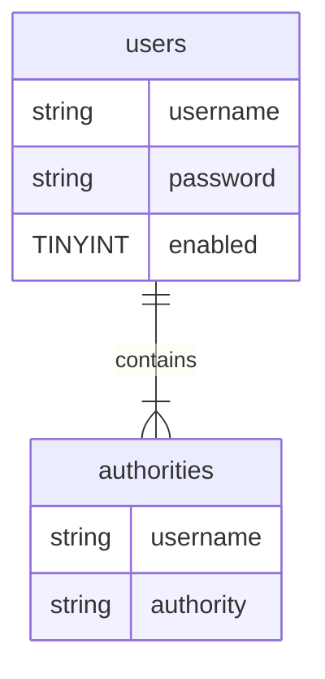

## Spring Security JDBC

### Overview
#### Database Support in Spring Security
- Spring Security can read user account info from database
- By default, you have to follow Spring Security's predefined table schemas


#### Development Process
##### 1. Develop SQL Script to setup database tables

```sql
CREATE TABLE `authorities` (
    `username` varchar(50) NOT NULL,
    `authority` varchar(50) NOT NULL,

    UNIQUE KEY  `authorities_idx_1` (`username`,`authority`),

    CONSTRAINT `authorities_ibfk_1`
    FOREIGN KEY (`username`)
    REFERENCE `users` (`username`)
) ENGINE=InnoDB DEFAULT CHARSET=latin1;
```
```sql
INSERT INTO `authorities`
VALUES
('jogn', 'ROLE_EMPLOYEE'),
('mary', 'ROLE_EMPLOYEE'),
('mary', 'ROLE_MANAGER'),
('susan', 'ROLE_EMPLOYEE'),
('susan', 'ROLE_ADMIN'),
```

##### 2. Add database support to Maven POM file
```xml
<!--MYSQL - JDBC Driver-->
<dependency>
    <groupId>mysql</groupId>
    <artifactId>mysql-connector-java</artifactId>
    <version>5.1.45</version>
</dependency>

<!--c3PO - DB CONNECTION POOL-->
<dependency>
    <groupId>com.mchange</groupId>
    <artifactId>c3p0</artifactId>
    <version>0.9.5.2</version>
</dependency>
```
##### 3. Create JDBC properties file
```conf
#
# JDBC connection properties
#
jdbc.driver=com.mysql.jdbc.Driver
jdbc.url=jdbc:mysql://localhost:3306/spring_security_demo?useSSL=false
jdbc.user=springstudent
jdbc.password=springstudent

#
# Connection pool properties
#
connection.pool.initialPoolSize=5
connection.pool.minPoolSize=5
connection.pool.maxPoolSize=20
connection.pool.maxIdleTime=3000
```
##### 4. Define Datasource in Spring Configuration
```java
@Configuration
@EnableWebMvc
@ComponentScan(basePackages = "com.luv2code.springsecurity.demo")
@PropertySource("classpath:persistence-mysql.properties")
public class DemoAppConfig{

    @Autowired
    private Environment env; // will hold data read from properties file

    @Bean
    public DataSource securityDataSource(){
        //create connection pool
        ComboPooledDataSource securityDataSource = new ComboPooledDataSource();

        // set the jdbc driver 
        try{
            securityDataSource.setDriverClass(env.getProperty("jdbc.driver"));

        }catch (PropertyVetoException exc) {
            throw new RuntimeException (exc);
        }

        // for sanit's sake, lets log url and user 
        logger.info(".... jdbc.url="+ env.getProperty("jdbc.url"));
        logger.info(".... jdbc.user="+ env.getProperty("jdbc.user"));

        //set database connection props
        securityDataSource.setJdbcUrl(env.getProperty("jdbc.url"));
        securityDataSource.setUser(env.getProperty("jdbc.user"));
        securityDataSource.setPassword(env.getProperty("jdbc.password"));

        //set connection pool props
        securityDataSource.setInitialPoolSize(Integer.parseInt(env.getProperty("connection.pool.initialPoolSize")));
        securityDataSource.setMinPoolSize(Integer.parseInt(env.getProperty("connection.pool.minPoolSize")));
        securityDataSource.setMaxPoolSize(Integer.parseInt(env.getProperty("connection.pool.maxPoolSize")));
        securityDataSource.setMaxIdleTime(Integer.parseInt(env.getProperty("connection.pool.maxIdleTime")));

        return securityDataSource;
    }
}
```
- `@PropertySource("classpath:persistence-mysql.properties")`
    - will read the props file
    - src/main/resources file are automatically copied to classpath during Maven build

##### 5. Update Spring Security Configuration to use JDBC
```java
@Configuration
@EnableWebSecurity
public class DemoSecurityConfig extends  WebSecurityConfigurerAdapter {

    @Autowired
    private DataSource securityDataSource;

    @Override
    protected void configure (AuthenticationManagerBuilder auth) throws Exception{
        auth.jdbcAuthentication().dataSource(securityDataSource);
    }
}

```

#### Spring Security Password Storage
- in Spring Security 5, passwords are stored using a specific format
```
{id}encodedPassword
```
|ID|Description|
|---|---|
|noop|Plain text passwords|
|brcypt|BCrypt password hashing|

```
INSERT INTO `users` 
VALUES
('john','{noop}test123','1'),
('marry','{noop}test123','1'),
('susan','{noop}test123','1');
```